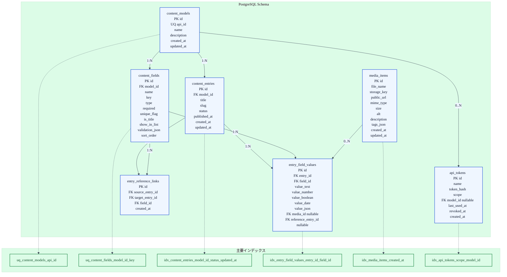

# DB設計図

目的:
- 将来 `PostgreSQL` に置き換える前提で、物理テーブル構成と主なキーを整理する
- モデル定義と可変フィールド値を分離した実装方針を示す

```mermaid
%%{init: {'theme': 'base', 'themeVariables': {
  'background': '#ffffff',
  'primaryColor': '#f8fafc',
  'primaryBorderColor': '#111827',
  'primaryTextColor': '#111827',
  'secondaryColor': '#eff6ff',
  'tertiaryColor': '#dcfce7',
  'lineColor': '#374151',
  'fontFamily': 'IBM Plex Sans, Noto Sans JP, sans-serif'
}}}%%
flowchart TB
  subgraph schema["PostgreSQL Schema"]
    models["content_models<br/>PK id<br/>UQ api_id<br/>name<br/>description<br/>created_at<br/>updated_at"]:::table
    fields["content_fields<br/>PK id<br/>FK model_id<br/>name<br/>key<br/>type<br/>required<br/>unique_flag<br/>is_title<br/>show_in_list<br/>validation_json<br/>sort_order"]:::table
    entries["content_entries<br/>PK id<br/>FK model_id<br/>title<br/>slug<br/>status<br/>published_at<br/>created_at<br/>updated_at"]:::table
    values["entry_field_values<br/>PK id<br/>FK entry_id<br/>FK field_id<br/>value_text<br/>value_number<br/>value_boolean<br/>value_date<br/>value_json<br/>FK media_id nullable<br/>FK reference_entry_id nullable"]:::table
    media["media_items<br/>PK id<br/>file_name<br/>storage_key<br/>public_url<br/>mime_type<br/>size<br/>alt<br/>description<br/>tags_json<br/>created_at<br/>updated_at"]:::table
    tokens["api_tokens<br/>PK id<br/>name<br/>token_hash<br/>scope<br/>FK model_id nullable<br/>last_used_at<br/>revoked_at<br/>created_at"]:::table
    refs["entry_reference_links<br/>PK id<br/>FK source_entry_id<br/>FK target_entry_id<br/>FK field_id<br/>created_at"]:::table
  end

  subgraph indexes["主要インデックス"]
    idxModels["uq_content_models_api_id"]:::index
    idxFields["uq_content_fields_model_id_key"]:::index
    idxEntries["idx_content_entries_model_id_status_updated_at"]:::index
    idxValues["idx_entry_field_values_entry_id_field_id"]:::index
    idxMedia["idx_media_items_created_at"]:::index
    idxTokens["idx_api_tokens_scope_model_id"]:::index
  end

  models -->|1:N| fields
  models -->|1:N| entries
  entries -->|1:N| values
  fields -->|1:N| values
  media -->|0..N| values
  entries -->|1:N| refs
  fields -->|1:N| refs
  models -->|0..N| tokens

  models -.-> idxModels
  fields -.-> idxFields
  entries -.-> idxEntries
  values -.-> idxValues
  media -.-> idxMedia
  tokens -.-> idxTokens

  classDef table fill:#eff6ff,stroke:#1d4ed8,color:#0f172a,stroke-width:1.5px;
  classDef index fill:#dcfce7,stroke:#15803d,color:#14532d,stroke-width:1.5px;
```
