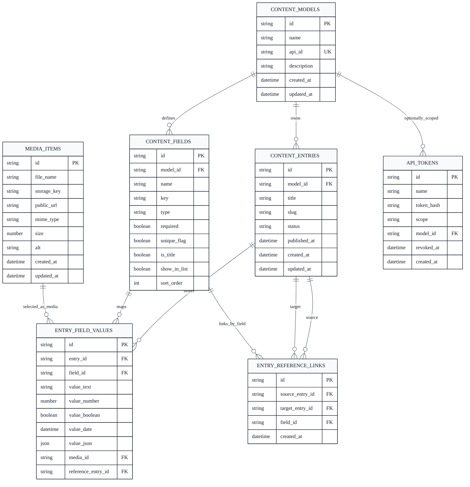

# ER図

目的:
- Conteful の主要エンティティと関係性を概念レベルで整理する
- Content Model に対して Entry と Field がぶら下がる構造を明確にする

```mermaid
%%{init: {'theme': 'base', 'themeVariables': {
  'background': '#ffffff',
  'primaryColor': '#f8fafc',
  'primaryBorderColor': '#111827',
  'primaryTextColor': '#111827',
  'lineColor': '#374151',
  'fontFamily': 'IBM Plex Sans, Noto Sans JP, sans-serif'
}}}%%
erDiagram
  CONTENT_MODELS {
    string id PK
    string name
    string api_id UK
    string description
    datetime created_at
    datetime updated_at
  }

  CONTENT_FIELDS {
    string id PK
    string model_id FK
    string name
    string key
    string type
    boolean required
    boolean unique_flag
    boolean is_title
    boolean show_in_list
    int sort_order
  }

  CONTENT_ENTRIES {
    string id PK
    string model_id FK
    string title
    string slug
    string status
    datetime published_at
    datetime created_at
    datetime updated_at
  }

  ENTRY_FIELD_VALUES {
    string id PK
    string entry_id FK
    string field_id FK
    string value_text
    number value_number
    boolean value_boolean
    datetime value_date
    json value_json
    string media_id FK
    string reference_entry_id FK
  }

  MEDIA_ITEMS {
    string id PK
    string file_name
    string storage_key
    string public_url
    string mime_type
    number size
    string alt
    datetime created_at
    datetime updated_at
  }

  API_TOKENS {
    string id PK
    string name
    string token_hash
    string scope
    string model_id FK
    datetime revoked_at
    datetime created_at
  }

  ENTRY_REFERENCE_LINKS {
    string id PK
    string source_entry_id FK
    string target_entry_id FK
    string field_id FK
    datetime created_at
  }

  CONTENT_MODELS ||--o{ CONTENT_FIELDS : defines
  CONTENT_MODELS ||--o{ CONTENT_ENTRIES : owns
  CONTENT_ENTRIES ||--o{ ENTRY_FIELD_VALUES : stores
  CONTENT_FIELDS ||--o{ ENTRY_FIELD_VALUES : maps
  MEDIA_ITEMS ||--o{ ENTRY_FIELD_VALUES : selected_as_media
  CONTENT_ENTRIES ||--o{ ENTRY_REFERENCE_LINKS : source
  CONTENT_ENTRIES ||--o{ ENTRY_REFERENCE_LINKS : target
  CONTENT_FIELDS ||--o{ ENTRY_REFERENCE_LINKS : links_by_field
  CONTENT_MODELS ||--o{ API_TOKENS : optionally_scoped
```
