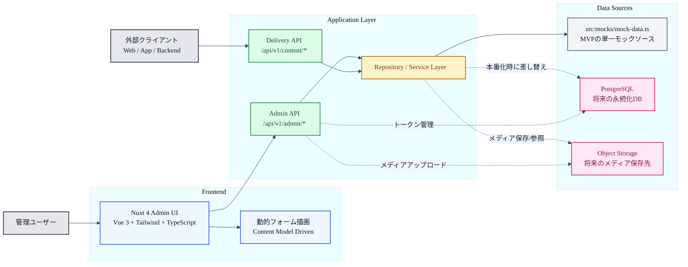

# システム関係図

目的:
- MVP時点のモック構成と、将来の本番構成への差し替え先を同時に示す
- 管理画面用の Admin API と外部公開用の Delivery API の責務分離を示す

```mermaid
%%{init: {'theme': 'base', 'themeVariables': {
  'background': '#ffffff',
  'primaryColor': '#f8fafc',
  'primaryBorderColor': '#111827',
  'primaryTextColor': '#111827',
  'secondaryColor': '#eff6ff',
  'tertiaryColor': '#ecfeff',
  'lineColor': '#374151',
  'fontFamily': 'IBM Plex Sans, Noto Sans JP, sans-serif'
}}}%%
flowchart LR
  adminUser["管理ユーザー"]:::actor
  externalClient["外部クライアント<br/>Web / App / Backend"]:::actor

  subgraph frontend["Frontend"]
    adminApp["Nuxt 4 Admin UI<br/>Vue 3 + Tailwind + TypeScript"]:::ui
    formEngine["動的フォーム描画<br/>Content Model Driven"]:::ui
  end

  subgraph app["Application Layer"]
    adminApi["Admin API<br/>/api/v1/admin/*"]:::api
    deliveryApi["Delivery API<br/>/api/v1/content/*"]:::api
    repository["Repository / Service Layer"]:::domain
  end

  subgraph data["Data Sources"]
    mockData["src/mocks/mock-data.ts<br/>MVPの単一モックソース"]:::mock
    postgres["PostgreSQL<br/>将来の永続化DB"]:::future
    objectStorage["Object Storage<br/>将来のメディア保存先"]:::future
  end

  adminUser --> adminApp
  adminApp --> formEngine
  adminApp --> adminApi
  externalClient --> deliveryApi

  adminApi --> repository
  deliveryApi --> repository

  repository --> mockData
  repository -. 本番化時に差し替え .-> postgres
  repository -. メディア保存/参照 .-> objectStorage

  adminApi -. トークン管理 .-> postgres
  adminApi -. メディアアップロード .-> objectStorage

  classDef actor fill:#e5e7eb,stroke:#111827,color:#111827,stroke-width:1.5px;
  classDef ui fill:#eff6ff,stroke:#1d4ed8,color:#0f172a,stroke-width:1.5px;
  classDef api fill:#dcfce7,stroke:#15803d,color:#14532d,stroke-width:1.5px;
  classDef domain fill:#fef3c7,stroke:#b45309,color:#78350f,stroke-width:1.5px;
  classDef mock fill:#f3f4f6,stroke:#4b5563,color:#111827,stroke-width:1.5px;
  classDef future fill:#fce7f3,stroke:#be185d,color:#831843,stroke-width:1.5px;
```
